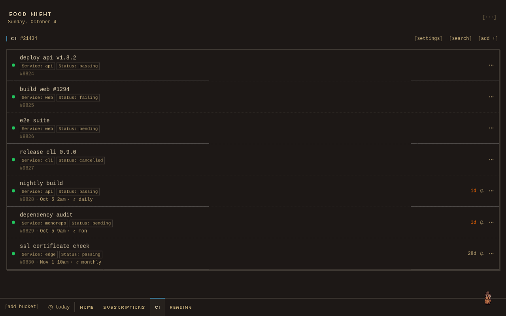
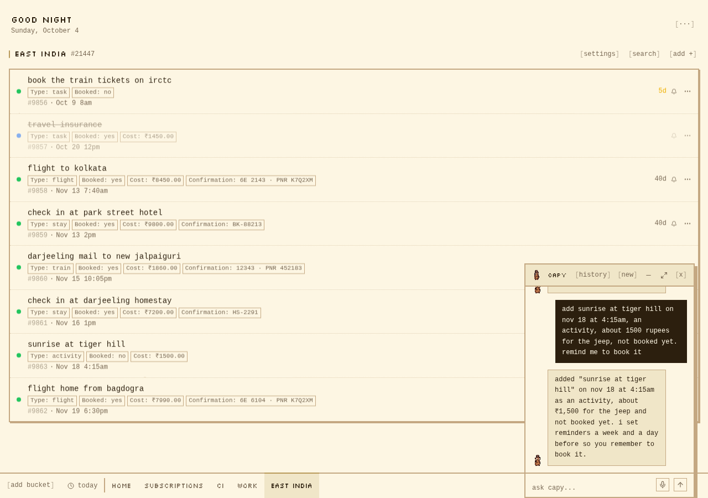
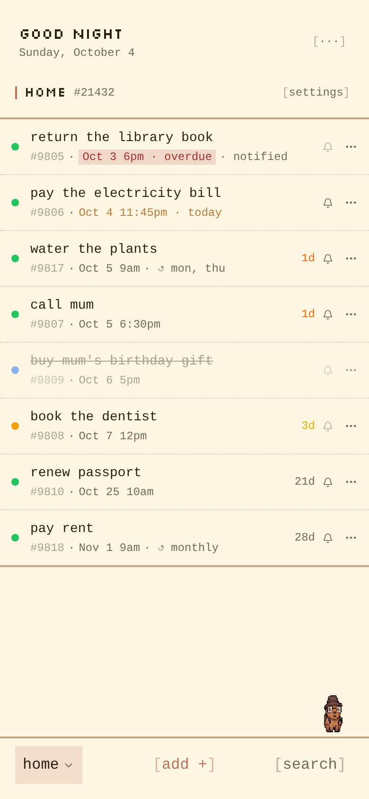
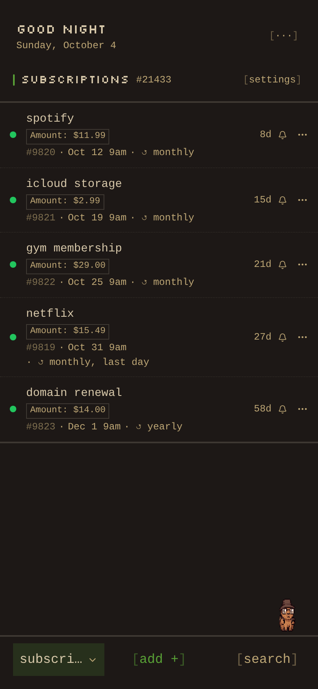

<p align="center">
  
</p>

<h1 align="center">heycapy</h1>

<p align="center">
  a capy to help you with your day. buckets, deadlines, reminders on the channels you already use, and an ai to chat with.
</p>

<p align="center">
  <a href="https://heycapy.xyz">heycapy.xyz</a> · <a href="https://heycapy.xyz/how-to-use">how to use</a> · <a href="https://status.heycapy.xyz">status</a>
</p>

<p align="center">
  <a href="https://github.com/heycapy/heycapy/actions/workflows/ci.yml"></a>
  <a href="LICENSE"></a>
  <a href="https://github.com/heycapy/heycapy/releases"></a>
</p>

## what it does

- **buckets**: a list for each part of your life, from a template (reminders, subscriptions, todo, work, ci/cd monitor) or blank. each bucket has its own sort order, channels, quiet hours and custom fields. archive or delete one and it can be brought back from the trash
- **items with dates**: type "pay rent friday 9am" and the date is picked out of the title. repeat daily, weekly, on chosen weekdays or on the last day of the month. up to 4 reminders per item, snooze, swipe to complete, long-press or right-click for quick dates
- **reminders that arrive**: send them by email (resend or your own smtp server), web push (iphone too, from the home screen), ntfy, telegram, discord, slack or any webhook url. pick the channels per bucket, with quiet hours, retries and a banner when a channel keeps failing. reminders live in the database, so a restart delays one instead of losing it
- **capy**: an assistant you can type or talk to. it adds, moves and completes items and changes bucket settings, using your own key (ollama, openai, anthropic, groq or gemini) or the server's
- **act from the reminder**: a done button and remind me again buttons (15 min, 30 min, 1 hour, tomorrow; you pick which per bucket) on email, push (android and desktop), ntfy and telegram. telegram also has reschedule, and can add items and list what's due
- **webhooks both ways**: every bucket has an incoming webhook that adds items. outgoing webhooks (up to 3 per user) post to discord, slack or any url with signed json ([standard webhooks](https://www.standardwebhooks.com))
- **yours**: self-hosted with docker and sqlite, nightly backups, full account export, 18 themes

## screenshots

<p align="center">
  
</p>

<p align="center">
  
</p>

<p align="center">
  
  &nbsp;&nbsp;
  
</p>

## run it locally

needs node 22+ and pnpm.

```sh
git clone https://github.com/heycapy/heycapy
cd heycapy
pnpm install
cp .env.example .env
```

in `.env`, set `JWT_SECRET` to the output of `openssl rand -base64 32` and `ENCRYPTION_KEY` to the output of `openssl rand -hex 32`, then:

```sh
pnpm dev
```

open [localhost:3000](http://localhost:3000) and sign in with any email. without an email service the sign in code shows on the screen.

## self-host with docker

needs docker with compose, and a domain pointing at your server for https.

```sh
git clone --branch v0.1.0 https://github.com/heycapy/heycapy
cd heycapy
cp .env.example .env
```

in `.env`:

- `JWT_SECRET`: the output of `openssl rand -base64 32`
- `ENCRYPTION_KEY`: the output of `openssl rand -hex 32`. keep it safe, keys and tokens saved in the app can't be read without it
- `APP_URL`: the address you'll open heycapy at, e.g. `https://heycapy.example.com`
- `RESEND_API_KEY` and `EMAIL_FROM` (or the `SMTP_*` lines), so sign in codes reach people by email

in `Caddyfile`, replace `yourdomain.com` with your domain. then:

```sh
docker compose up -d --build
```

open your domain. caddy gets the https certificate on its own. the database lives in a docker volume at `/data/heycapy.db`.

if something's missing heycapy won't start and says what to fix: `docker compose logs heycapy`. the logs mention `localhost:3000`, that's only inside docker, caddy is the way in.

### try it on your own machine first

set `APP_URL=http://localhost`, put `:80` instead of the domain in `Caddyfile`, and open [localhost](http://localhost) (not `localhost:3000`, that port only exists inside docker). email is optional like this: without it the sign in code shows on the screen, which heycapy only allows when `APP_URL` is localhost.

### upgrading

back up first, then move to the new version:

```sh
docker compose stop heycapy
docker compose cp heycapy:/data ./heycapy-backup
git fetch --tags
git checkout v0.1.1
docker compose up -d --build
```

stopping first matters: while heycapy runs, recent changes sit in a separate `heycapy.db-wal` file that a copy can miss.

the database updates itself on start. what changed is in [CHANGELOG.md](CHANGELOG.md).

### restoring a backup

every night heycapy saves a copy of the database in `backups/` (see "running it"). each file is complete on its own. you also need the `.env` from back then: without the same `ENCRYPTION_KEY`, the keys and tokens saved in the app can't be read. a different `JWT_SECRET` only signs everyone out.

1. stop heycapy and get the backup file next to your `docker-compose.yml`. if it's still on the server:

   ```sh
   docker compose stop heycapy
   docker compose cp heycapy:/data/backups ./heycapy-backups
   ```

   on a new server, put your off-server copy there instead and set up `.env` and `Caddyfile` as in "self-host with docker".

2. restore it, with the name of the file you want:

   ```sh
   docker compose run --rm --no-deps --user root \
     -v "$PWD/heycapy-backups/heycapy-2026-10-04.db:/restore.db:ro" \
     --entrypoint sh heycapy -c '
       mkdir -p /data/before-restore
       mv /data/heycapy.db* /data/before-restore/ 2>/dev/null
       cp /restore.db /data/heycapy.db
       chown nextjs:nodejs /data/heycapy.db'
   ```

3. start it again and sign in:

   ```sh
   docker compose up -d
   ```

the database you replaced is kept in `before-restore/` inside the volume, so a wrong pick can be undone. delete that folder once you're sure.

don't copy the file in with `docker compose cp` instead: the old `heycapy.db-wal` stays behind and is applied on top, which silently undoes the restore, and the file ends up owned by the wrong user so heycapy can't write to it.

restoring after a bad upgrade: `git checkout` the previous version first, then restore, then `docker compose up -d --build`. restoring a backup made by a newer version into an older one isn't supported.

if you want the exact state from the upgrade step (`./heycapy-backup`, a full copy of `/data`), mount that folder instead (`-v "$PWD/heycapy-backup:/restore:ro"`) and use these two lines in place of the `cp` and `chown` ones. the `.db` and `-wal` files have to stay together:

```sh
cp /restore/heycapy.db* /data/
chown nextjs:nodejs /data/heycapy.db*
```

## configuration

everything is in `.env.example`. the main ones:

| var | what it's for |
|-----|---------------|
| `JWT_SECRET`, `ENCRYPTION_KEY` | required secrets |
| `DATABASE_URL` | required in production, on persistent storage |
| `RESEND_API_KEY`, `EMAIL_FROM` | sends sign in codes and email reminders (or use `SMTP_*`). required in production unless `APP_URL` is localhost |
| `APP_URL` | your public url, for telegram and reminder links. required in production |
| `TELEGRAM_BOT_TOKEN` | turns on telegram |
| `ADMIN_EMAILS` | who sees the system tab and gets alerts |
| `AI_PROVIDER`, `AI_MODEL`, `AI_API_KEY` | the ai for users without their own key. leave them out and each user adds their own in tweaks → ai |

users set up their own ai key, ntfy, smtp and notifications inside the app.

### only for heycapy.xyz

| var | what it's for |
|-----|---------------|
| `HOSTED=true` | users without their own key pay for the server ai in credits. chat and voice then use the models and prices in `src/lib/ai/tiers.ts` instead of `AI_PROVIDER` / `AI_MODEL` / `AI_API_KEY`. also refuses ollama, and ntfy or smtp servers on a private network (localhost, 192.168.x.x, docker names), so a local ntfy stops working |
| `GEMINI_API_KEY`, `GROQ_API_KEY`, `OPENAI_API_KEY`, `ANTHROPIC_API_KEY` | one key per provider the tiers use. the server won't start while one it needs is missing |

leave these out when self-hosting.

## running it

- **push notifications** work out of the box over https. on iphone they need "add to home screen".
- **health checks**: `/api/health` for your platform, `/api/health/scheduler` for an uptime monitor (it returns 503 when reminders are stuck).
- **backups**: every night the database is copied to a `backups/` folder next to it, keeping the last 7. it lives in the same docker volume as the database, so copy it off the server too (`docker compose cp heycapy:/data/backups .`), along with your `.env`. [how to restore](#restoring-a-backup)

## stack

next.js · typescript · tailwind · sqlite with drizzle · node-cron
